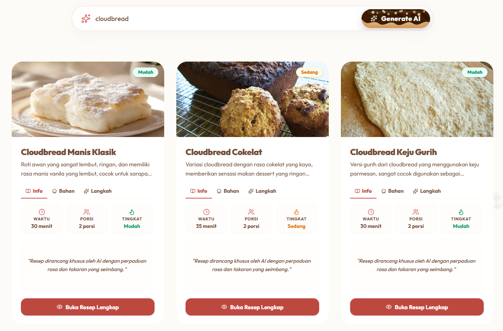
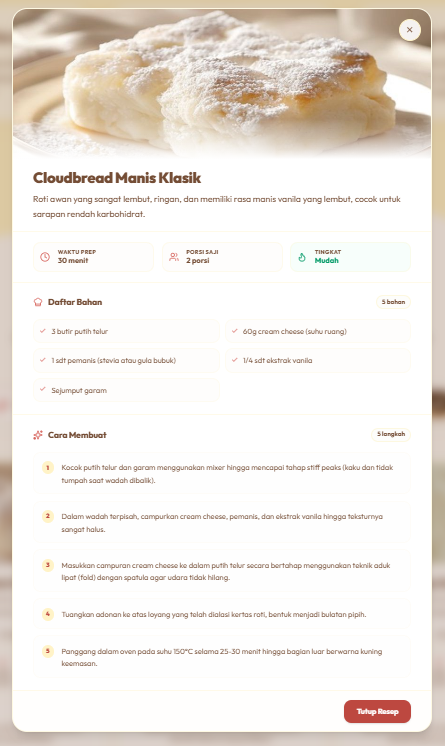
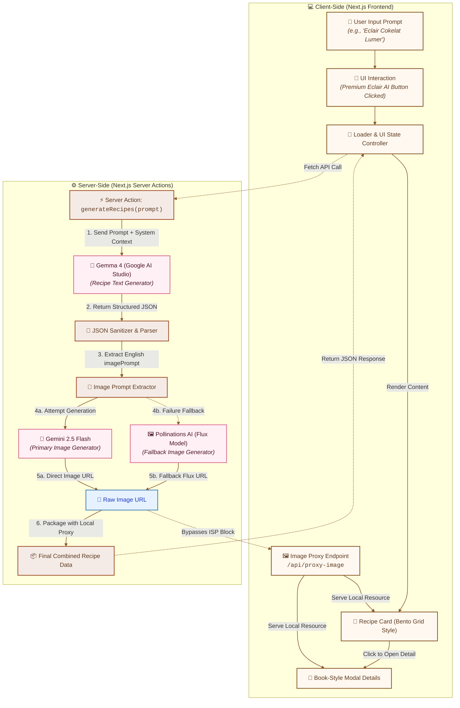

# <p align="center"></p>

# <p align="center">🍞 KokiMugi: The AI Bakery Experience</p>

<p align="center">
  <strong>Reimagining the art of baking through the lens of Generative AI.</strong><br>
  Built using <b>Gemini 3.1 Pro & Gemini 3.5 Flash Hight</b> for the <b>#JuaraVibeCoding</b> challenge.
</p>

---

## 🌟 Overview

**KokiMugi** adalah platform eksplorasi kuliner masa depan yang menggabungkan estetika desain premium dengan kekuatan **Artificial Intelligence**. Kami tidak hanya memberikan resep; kami menciptakan pengalaman visual dan interaktif bagi para pecinta _baking_ untuk meracik mahakarya mereka sendiri.

Aplikasi ini dikembangkan secara penuh menggunakan **Gemini 3.1 Pro**, memastikan setiap baris kode dan elemen desain memiliki kualitas terbaik dan efisiensi tinggi, sejalan dengan semangat **#JuaraVibeCoding**.

<p align="center">
  
  <br>
  <i>Inilah sosok Koki Mugi, sang ahli baking yang akan memandu petualangan kuliner Anda.</i>
</p>

---

## 📸 Galeri & Preview Tampilan

Untuk menghadirkan pengalaman visual kelas dunia, KokiMugi hadir dengan antarmuka bertema *bakery* yang dirancang secara detail:

### 1. AI Prompt & Kartu Resep Pintar
Halaman pencarian resep bertenaga AI dengan kartu resep interaktif. Setiap kartu dilengkapi sistem tab internal untuk melihat **Info**, **Bahan**, dan **Langkah Pembuatan** secara instan tanpa perlu membuka halaman baru.

<p align="center">
  
</p>

### 2. Modal Detail Resep Premium
Modal resep bergaya buku resep premium (*book-style recipe layout*). Dilengkapi dasbor statistik, grid 2-kolom daftar bahan dengan checkmark minimalis, serta timeline langkah pembuatan yang terstruktur rapi.

<p align="center">
  
</p>

---

## 🤖 AI-Powered Intelligence

KokiMugi ditenagai oleh model AI tercanggih dari Google untuk memberikan hasil yang presisi dan kreatif:

- **Gemini 2.5 FLash**: Otak di balik sistem rekomendasi resep yang mampu memahami instruksi kompleks dan menghasilkan data JSON terstruktur untuk UI yang dinamis.
- **Gemma 4**: Digunakan untuk eksperimen model lokal dan optimasi prompt yang lebih spesifik pada ranah kuliner.

---

## 📊 System Architecture

Bagaimana KokiMugi bekerja? Berikut adalah alur cerdas dari input pengguna hingga menjadi resep visual:



---

## ✨ Features

- **🎨 Premium 3D UI & Custom Buttons**: Antarmuka interaktif dengan tombol-tombol bertema kue 3D (Eclair Cokelat dengan toping meses mengkilap, Ice Cream Sandwich, Tiramisu) yang responsif dan memukau.
- **🤖 AI Recipe Crafter**: Konsultasikan ide gila Anda, dan biarkan Gemini meracik komposisi bahan serta teknik yang sempurna.
- **🗂️ Interactive Recipe Cards**: Kartu hasil rekomendasi dengan sistem tab internal (**Info**, **Bahan**, **Langkah**) dan tinggi terstandarisasi untuk kenyamanan membaca.
- **📖 Book-style Recipe Modals**: Modal detail resep premium bergaya buku resep, lengkap dengan visualisasi bahan dan langkah pembuatan.
- **✨ Touchpad-Friendly Gallery**: Galeri inspirasi yang mendukung gesture geser 2-jari touchpad (*native overflow scroll*) dan mouse dragging di komputer desktop secara mulus.
- **🌊 Fluid Animations**: Transisi gelombang (_wave_) dan animasi halus menggunakan _Framer Motion_ untuk pengalaman pengguna yang _seamless_.

---

## 🛠️ Tech Stack

| Layer          | Technology                                         |
| :------------- | :------------------------------------------------- |
| **Framework**  | [Next.js 16.2.6](https://nextjs.org/) (App Router) |
| **Language**   | [TypeScript](https://www.typescriptlang.org/)      |
| **Styling**    | [Tailwind CSS v4](https://tailwindcss.com/)        |
| **Animations** | [Framer Motion](https://www.framer.com/motion/)    |
| **AI API**     | Google Gemini SDK                                  |
| **Runtime**    | [Bun](https://bun.sh/)                             |

---

## 🎨 Design System: The Bakery Palette

Desain kami terinspirasi dari kehangatan toko roti di pagi hari:

- **Creamy White**: Melambangkan tepung dan kelembutan krim.
- **Choco Brown**: Kedalaman rasa cokelat premium.
- **Golden Honey**: Warna karamel dan keemasan roti yang matang sempurna.

---

## 🚀 Getting Started

Pastikan Anda memiliki [Bun](https://bun.sh/) terinstal di sistem Anda.

1.  **Clone & Install**:

    ```bash
    git clone https://github.com/username/kokimugi.git
    cd kokimugi
    bun install
    ```

2.  **Environment Setup**:
    Buat file `.env` dan tambahkan `GOOGLE_AI_API_KEY`.

3.  **Run Development**:
    ```bash
    bun run dev
    ```

---

<p align="center">
  <b>#JuaraVibeCoding | KokiMugi Developer Team</b><br>
  <i>"Di mana data bertemu rasa."</i>
</p>
